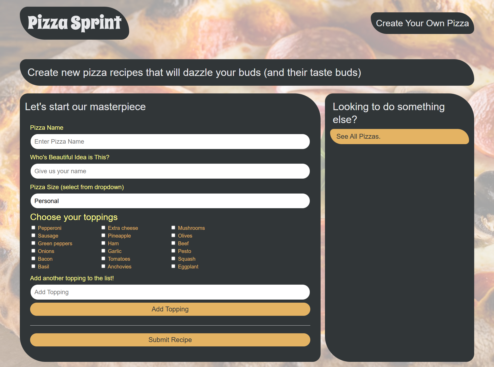
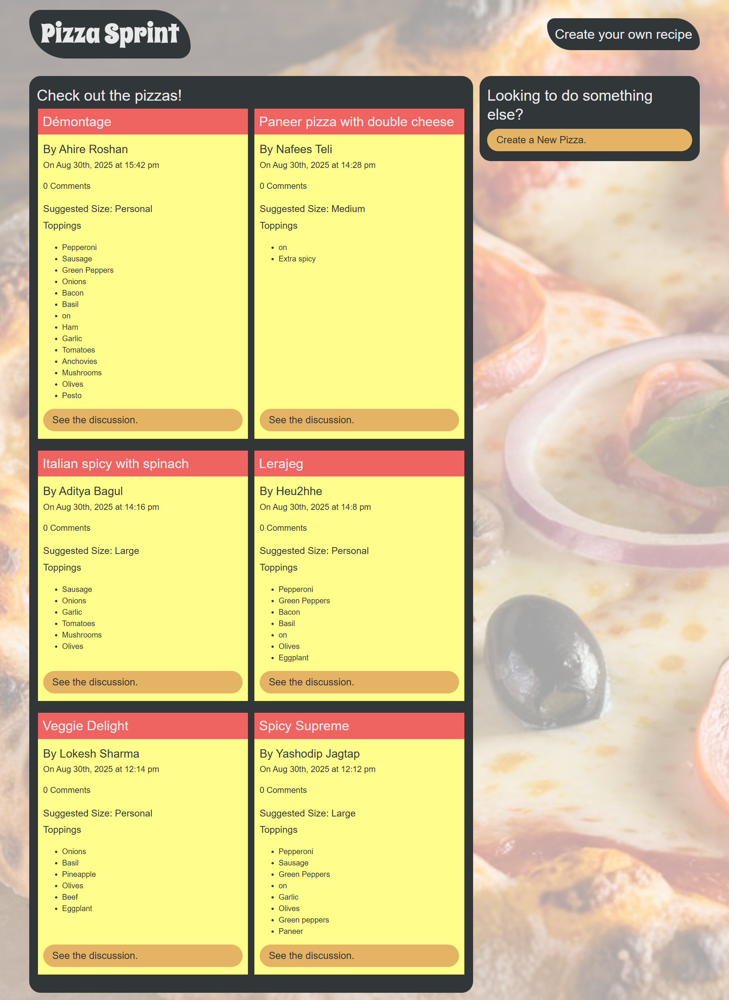

# Pizza Sprint

A Pizza Management System to streamline restaurant operations, including pizza listing, adding new pizzas, and viewing pizza details.

## Table of Contents
1. [Problem Statement](#problem-statement)
2. [Solution](#solution)
3. [Description](#description)
4. [Installation](#installation)
5. [Usage](#usage)
6. [Technologies Used](#technologies-used)
7. [Screenshots](#screenshots)
8. [Links](#links)
9. [Author](#author)

## Problem Statement

Managing a pizza restaurant manually is challenging and error-prone. Restaurants struggle with:
- Keeping the menu up-to-date.
- Managing pizza inventory efficiently.
- Tracking orders and available pizzas.

## Solution

Pizza Sprint simplifies pizza management with the following features:
- View Available Pizzas: A centralized list displaying all pizzas with details.
- Add New Pizzas: Easily add new pizzas with descriptions, prices, and other details.
- View Pizza Details: View detailed information about individual pizzas for better management.

This system improves efficiency, reduces errors, and enhances customer satisfaction by ensuring an accurate and well-managed pizza menu.

## Description

This project served as an introduction to NoSQL, MongoDB, and the Mongoose ODM technologies. I created a web app that allows users to create and save their own custom pizza recipes using MongoDB as the database. Users can also view other users' pizza recipes and leave comments on them. The app utilizes MongoDB's flexible schema and scalability to efficiently handle and store large amounts of recipe and user data.

## Installation

To install this application on your local machine:

1. Clone the application's repository and place it into a local directory on your computer.
2. Ensure that your computer has Node.js installed.
3. Open a command-line interface (e.g., VS Code, Git Bash) and navigate to the root directory.
4. Install the application's dependencies using the following command:
```
npm install
```
5. Start the application by typing the following command. Your default web browser will then open the application in a new tab:
```
npm start
```

## Usage

To use this application:
- View pizza recipes saved in the MongoDB database on the homepage.
- To create a pizza recipe, click on the "Create a New Pizza" button.
- Fill out the form with pizza details like name, size, toppings, and submitter name.
- Once submitted, the newly created pizza recipe will appear on the homepage.
- Click on the "See the Discussion" button to view or add comments to a pizza recipe.
- Users can leave comments or reply to other users' comments.

## Technologies Used

- NoSQL
- MongoDB
- Mongoose ODM
- Node.js
- Express.js
- HTML/CSS
- JavaScript

## Screenshots

### Add Pizza Page


### Pizza List Page


## Links

- Link to Deployed Application on Render: https://pizzasprint.onrender.com
- GitHub Repository - Pizza Sprint: https://github.com/YashodipJagtap/PizzaSprint

## Author

Yashodip Jagtap: https://github.com/YashodipJagtap